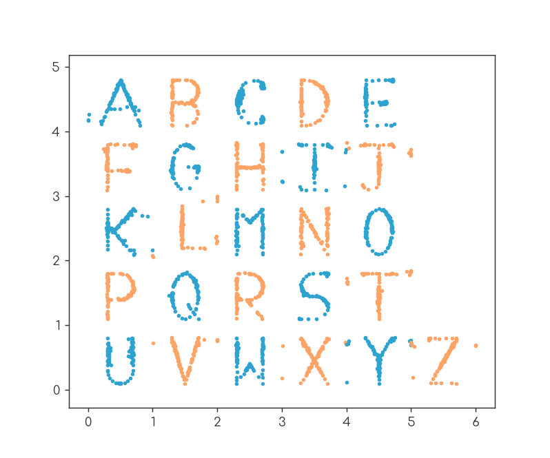
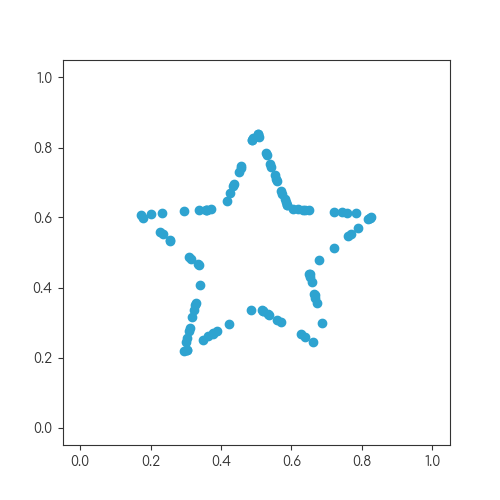

# The databet

This repo contains 27 datasets: 26 of these resemble the letters of the alphabet, the 27th is a star:

For each of the datasets (to 2 decimal places):

- The mean of the x-values is 0.50
- The mean of the y-values is 0.52
- The standard deviation of the x-values is 0.17
- The standard deviation of the y-values is 0.18
- The correlation coefficient is 0.16

The dataset for each letter of the alphabet can be found in JSON format in the [letters](letters) folder.

You can read more about these datasets at [mscroggs.co.uk/blog/101](https://mscroggs.co.uk/blog/101).
